# Hybrid Cloud Lab — GCP + On-Premises (VMware Workstation)

Lab triển khai hạ tầng **hybrid cloud** kết hợp Google Cloud Platform và môi trường On-Premises chạy trên VMware Workstation, kết nối qua **HA VPN IPSec + BGP**.

---

## Mục tiêu

Xây dựng hệ thống web app thực tế với:

- **Frontend & Backend** chạy trên GCP, đóng gói bằng Docker Compose, image build sẵn qua Packer + Ansible
- **Database (PostgreSQL)** đặt on-premises, backend GCP kết nối về qua VPN tunnel
- **HA VPN 2 tunnel + BGP** đảm bảo kết nối không gián đoạn khi một tunnel lỗi
- **pfSense HA (CARP)** on-premises để VPN không có single point of failure

---

## 1.Kiến trúc tổng quan


**Luồng traffic:**
User → nginx:80 → /api/* → Backend:3001 → VPN Tunnel → PostgreSQL on-prem:5432

User → /      → Frontend:3000

---

## Cấu trúc thư mục


---

## 3.Stack công nghệ

| Layer | Công nghệ |
|---|---|
| Cloud Provider | Google Cloud Platform (asia-east2) |
| IaC | Terraform ~> 5.0 |
| Image Build | Packer + Ansible |
| Container Runtime | Docker Compose |
| VPN | GCP HA VPN + IPSec IKEv2 + BGP |
| On-prem Firewall | pfSense HA (CARP failover) |
| Routing Protocol | BGP (GCP ASN 65001 ↔ pfSense ASN 65002) |
| OS | Ubuntu 22.04 LTS |
| Database | PostgreSQL (on-premises) |

---

## 4.Hướng dẫn triển khai

### Yêu cầu

- `gcloud` CLI đã xác thực (`gcloud auth application-default login`)
- `terraform >= 1.5.0`
- `packer` đã cài
- `ansible` đã cài, đã chạy `ansible-galaxy install -r requirements.yml`
- Service Account `packer@<project-id>.iam.gserviceaccount.com` có role `Compute Admin`

---

### Bước 1 — Build GCP images với Packer + Ansible

Packer tạo VM tạm trên GCP, Ansible chạy playbook cài app, rồi đóng gói thành custom image.

```bash
cd infrastructure/packer

packer init frontend.pkr.hcl && packer build frontend.pkr.hcl
packer init backend.pkr.hcl  && packer build backend.pkr.hcl
```

Ansible thực hiện theo thứ tự trong mỗi playbook:

1. `docker_role` — Cài Docker CE + Docker Compose plugin
2. `frontend_role` / `backend_role` — Render config từ template J2, tạo thư mục `/opt/app`
3. `post_provisioning_role` — Thêm user `ubuntu` vào group `docker`

---

### Bước 2 — Tạo hạ tầng GCP với Terraform

```bash
cd infrastructure/terraform

terraform init
terraform plan
terraform apply --auto-approve
```

Tài nguyên được tạo:

- VPC `main-vpc`, subnet `192.168.1.0/24`
- Cloud Router (BGP ASN 65001), Cloud NAT
- VM frontend (public IP) + VM backend (static internal IP `192.168.1.100`)
- HA VPN Gateway (2 interfaces), 2 VPN tunnels, 2 BGP peers
- Firewall rules (SSH, HTTP, HTTPS, BGP port 179, on-prem traffic)

---

### Bước 3 — Cấu hình pfSense On-Premises

Sau khi `terraform apply` xong, lấy IP của 2 VPN interface từ Google Cloud Console.

**Cấu hình IPSec:**

| Thông số | Giá trị |
|---|---|
| IKE Version | IKEv2 |
| Pre-shared Key | Giá trị `vpn_shared_secret` trong tfvars |
| Local IP (pfSense) | CARP VIP `192.168.175.190` |
| Remote Gateway Tunnel 1 | IP interface 0 của GCP HA VPN |
| Remote Gateway Tunnel 2 | IP interface 1 của GCP HA VPN |
| Phase 2 Traffic Selector | `192.168.10.0/24` ↔ `192.168.1.0/24` |

**Cấu hình BGP:**

| Thông số | Giá trị |
|---|---|
| Local ASN | 65002 |
| Neighbor 1 | `169.254.128.41` (GCP tunnel 1) |
| Neighbor 2 | `169.254.151.181` (GCP tunnel 2) |
| Remote ASN | 65001 |
| Advertise | `192.168.10.0/24` |

---

### Bước 4 — Kiểm tra kết nối

```bash
# Ping PostgreSQL on-prem từ backend VM
ping 192.168.10.33

# Kiểm tra kết nối DB
psql -h 192.168.10.33 -p 5432 -U dev_user -d immutiblecloud

```

---

## 5. pfSense HA + VPN

### 5.1 CARP — Virtual IP Failover

pfSense HA chạy trên 2 node (Primary + Secondary). Thay vì bind VPN vào IP vật lý của từng node, toàn bộ traffic đi qua **CARP VIP** — một IP ảo nổi giữa 2 node. Khi Primary down, Secondary tự nhận VIP trong vài giây mà không cần cấu hình lại gì trên GCP.

Có 2 VIP được tạo — một trên interface WAN, một trên LAN — để đảm bảo cả traffic ra internet lẫn traffic nội bộ đều failover đồng thời.

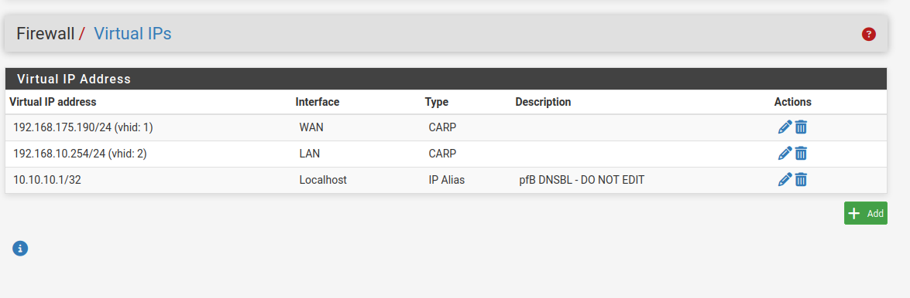
> Danh sách Virtual IPs trên pfSense — thấy cả 2 VIP đang ở trạng thái MASTER trên node Primary.

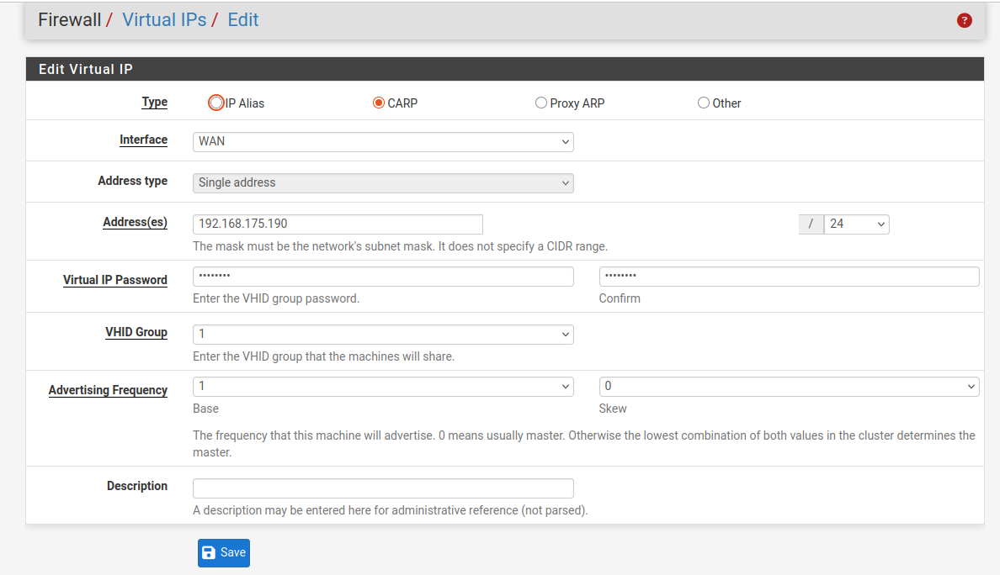
> CARP VIP phía WAN — đây là IP mà pfSense dùng để chủ động kết nối (Initiator) ra GCP HA VPN. pfSense nằm sau NAT nên không có IP public riêng, buộc phải là Initiator thay vì Responder.

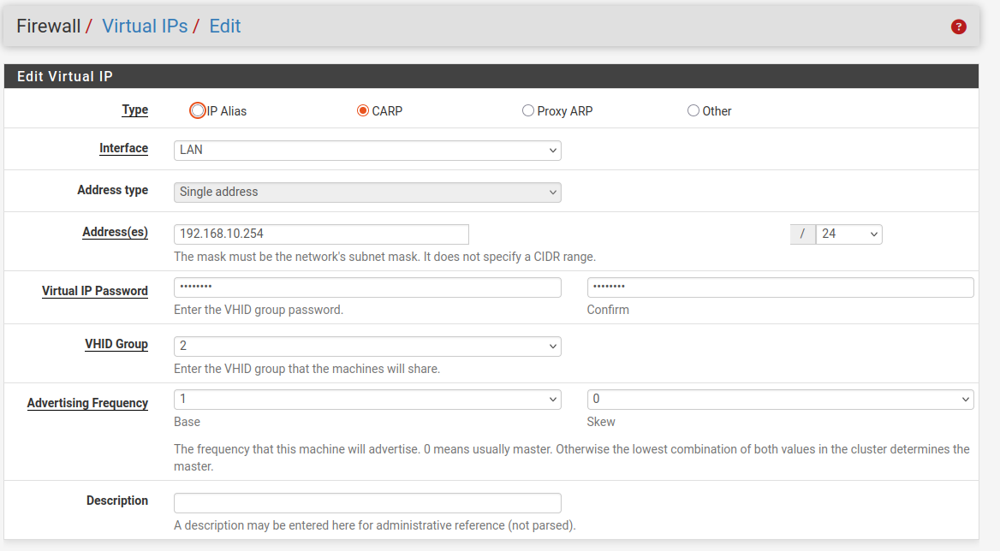
> CARP VIP phía LAN — đảm bảo traffic từ on-prem về GCP cũng đi qua VIP thay vì IP vật lý của node.

---

### 5.2 HA Sync — Đồng bộ cấu hình giữa 2 node

Để failover hoạt động đúng, toàn bộ cấu hình IPSec, firewall rules, VIP phải được đồng bộ liên tục từ Primary sang Secondary qua XMLRPC sync.

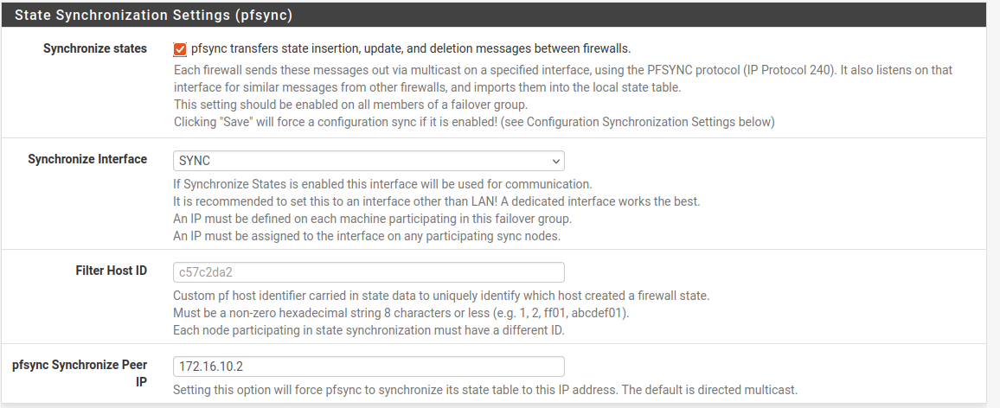
> Cấu hình State Sync (pfsync) — đồng bộ connection state table để khi failover xảy ra các session đang chạy không bị drop.

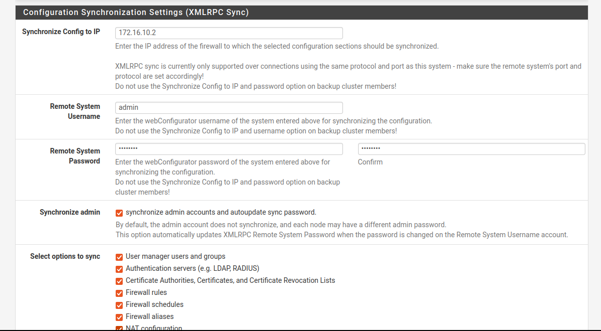
> Cấu hình Configuration Sync (XMLRPC) — tự động đẩy toàn bộ config từ Primary sang Secondary mỗi khi có thay đổi. Nhờ đây Secondary luôn sẵn sàng takeover mà không cần cấu hình lại thủ công.

---

### 5.3 IPSec — 2 Tunnel lên GCP HA VPN

GCP HA VPN yêu cầu **2 tunnel** để đạt SLA 99.99%. Mỗi tunnel kết nối từ CARP VIP của pfSense đến một interface khác nhau trên GCP VPN Gateway. Khi một tunnel down, BGP tự reroute traffic sang tunnel còn lại mà không bị gián đoạn.

**Tunnel 1 — Phase 1**

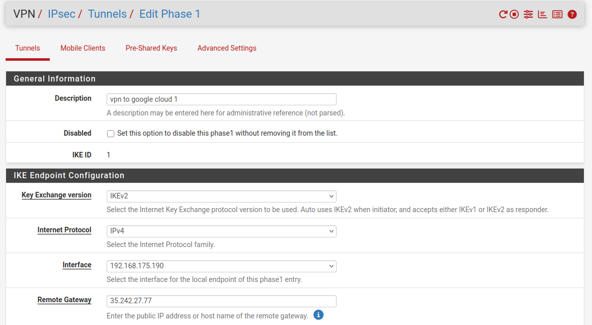
> Phase 1 tunnel 1: IKEv2, bind vào CARP VIP, Remote Gateway là IP interface 0 của GCP HA VPN.

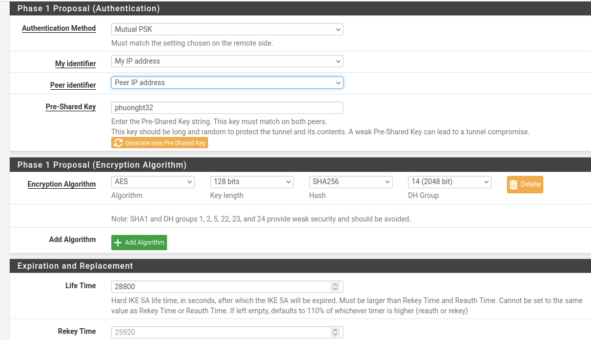
> Encryption settings Phase 1 tunnel 1 — phải khớp chính xác với cấu hình phía GCP.

**Tunnel 1 — Phase 2**

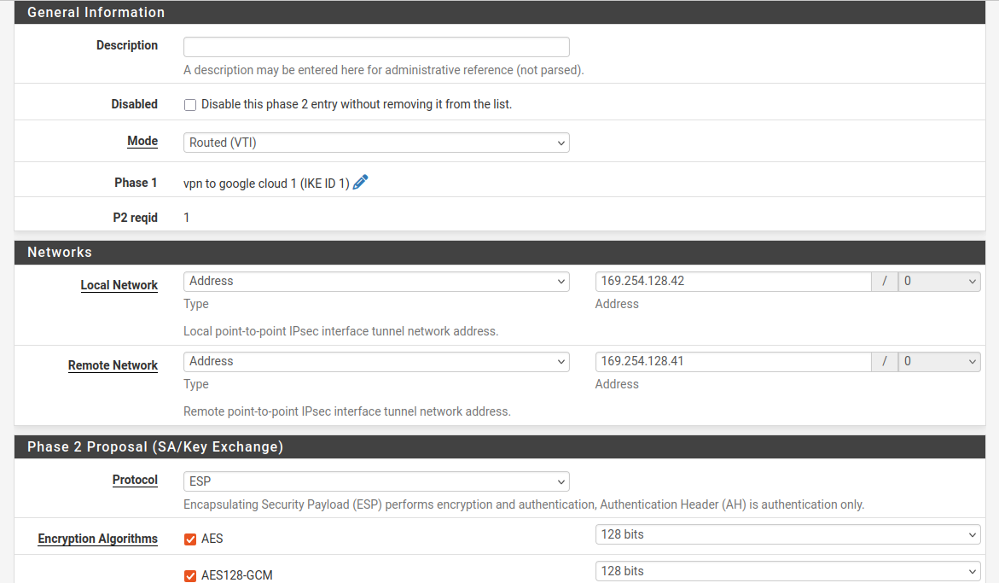
> Phase 2 tunnel 1: Traffic selector `192.168.10.0/24` (on-prem DB subnet) ↔ `192.168.1.0/24` (GCP VPC subnet).

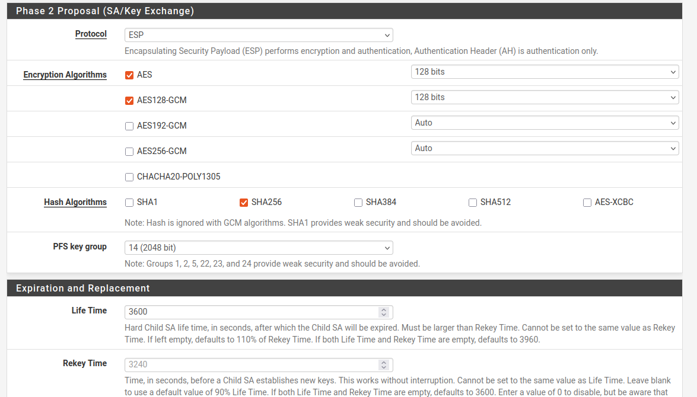
> Encryption settings Phase 2 tunnel 1.

**Tunnel 2 — Phase 1**

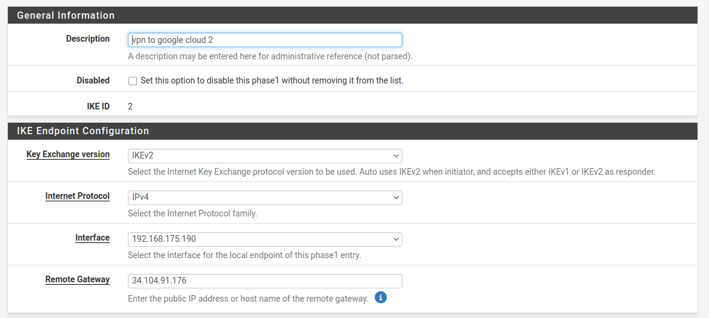
> Phase 1 tunnel 2: Tương tự tunnel 1 nhưng Remote Gateway là IP interface 1 của GCP HA VPN.

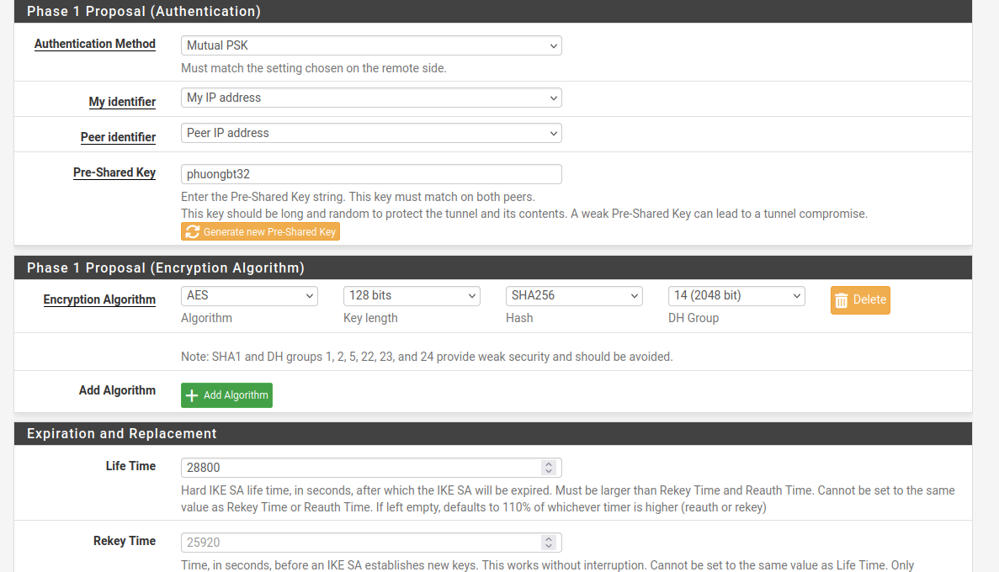

**Tunnel 2 — Phase 2**

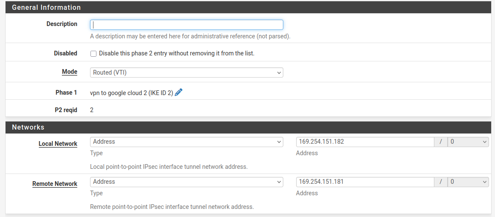
> Phase 2 tunnel 2: Traffic selector giống tunnel 1 — cùng subnet, chỉ khác đường đi vật lý.

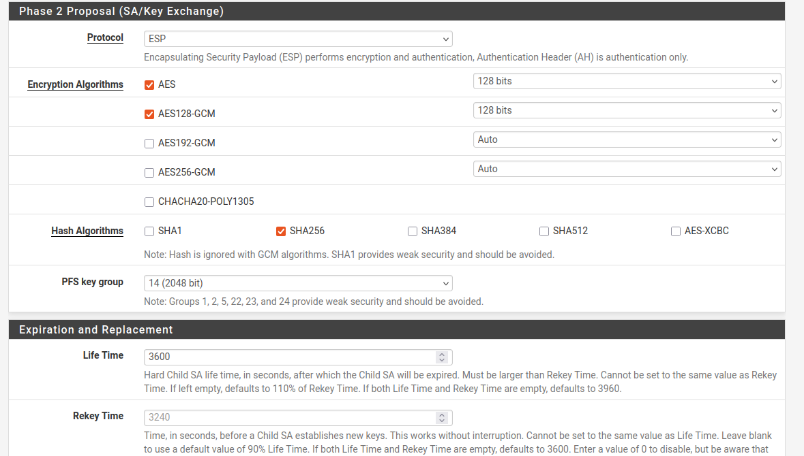

### 5.4 BGP — Quảng bá route qua FRR (pfSense)

BGP chạy trên pfSense qua package **FRR (Free Range Routing)**. Mỗi tunnel IPSec có một BGP session riêng — khi một tunnel down, BGP tự reroute toàn bộ traffic sang tunnel còn lại mà không cần can thiệp thủ công.

**Thông số BGP:**

| Thông số | Giá trị |
|---|---|
| Local ASN (pfSense) | 65002 |
| Remote ASN (GCP) | 65001 |
| Router ID | 192.168.175.190 (CARP VIP) |
| Neighbor 1 | 169.254.128.41 (GCP tunnel 1) |
| Neighbor 2 | 169.254.151.181 (GCP tunnel 2) |
| Subnet advertise về GCP | 192.168.10.0/24 |

**FRR Global Settings — bật FRR, khai báo Router ID và password:**

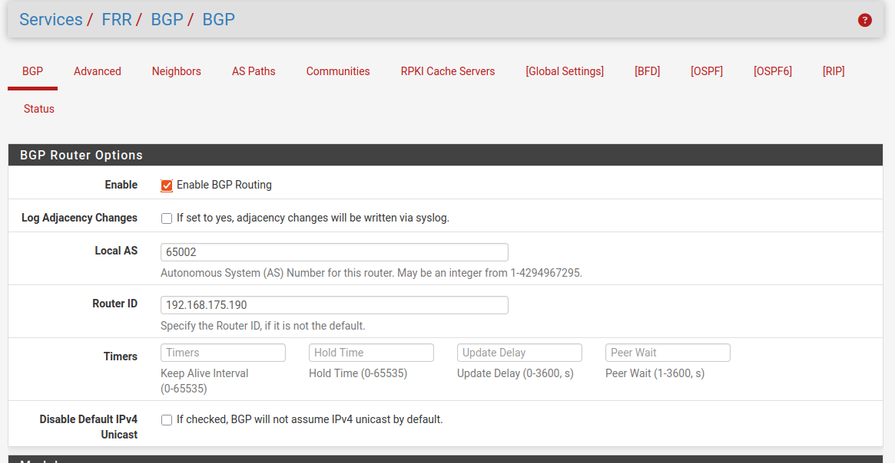

**BGP General — khai báo subnet:**

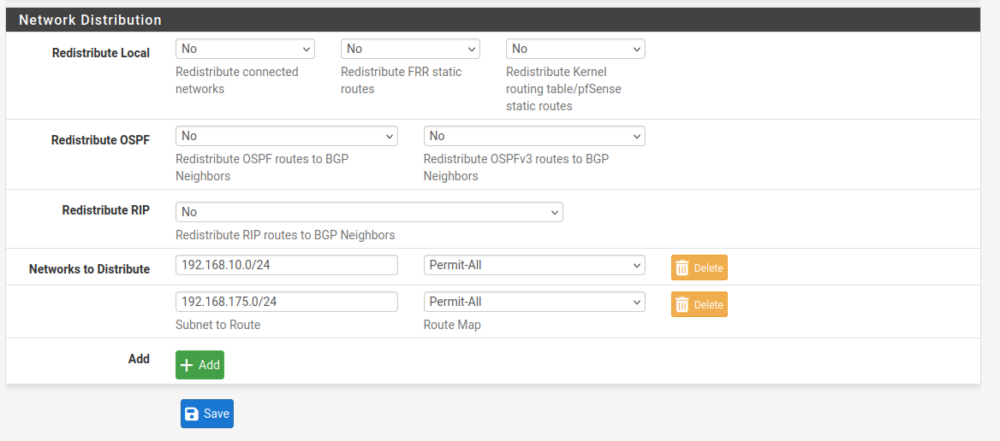

**BGP Neighbors — 2 peer tương ứng với 2 tunnel lên GCP:**

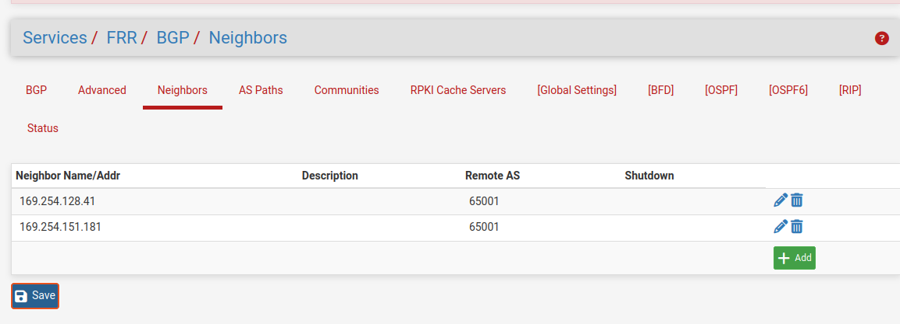

**Xác nhận BGP hoạt động — `show ip bgp summary` qua Diagnostics → Command Prompt:**

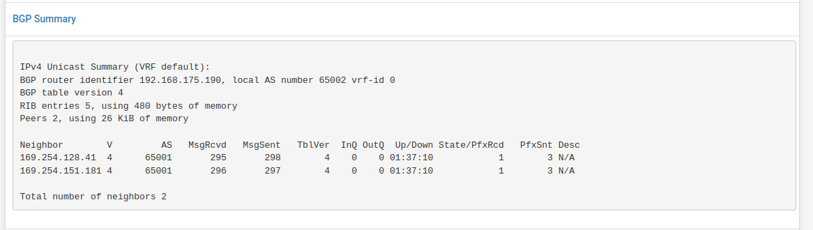
> Cả 2 neighbor `169.254.128.41` và `169.254.151.182` ở trạng thái Established — BGP session lên thành công trên cả 2 tunnel.

**Route và nexthops**
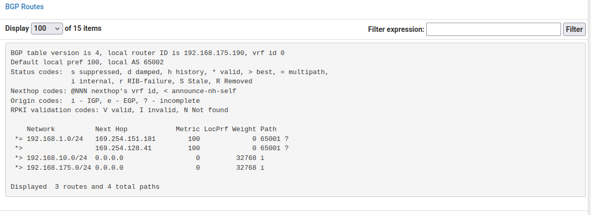

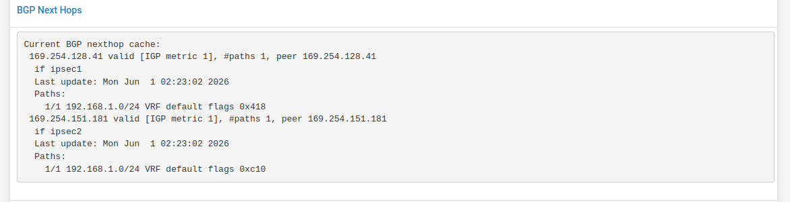


**Route nhận được từ GCP — `show ip route bgp`:**

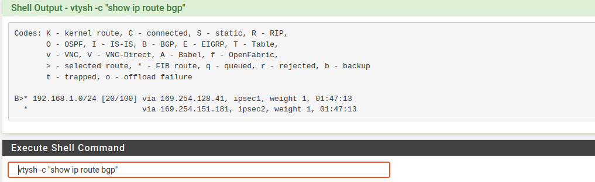
> pfSense đã nhận được route `192.168.1.0/24` (GCP VPC subnet) từ GCP qua BGP — traffic on-prem → GCP được forward đúng qua tunnel thay vì bị drop.

---

### 5.5 Xác nhận từ phía GCP

Để chứng minh kết nối hoạt động 2 chiều, phía GCP cũng phải thấy tunnel Established và học được route on-prem qua BGP.

**GCP VPN Tunnels — cả 2 tunnel ở trạng thái Established:**

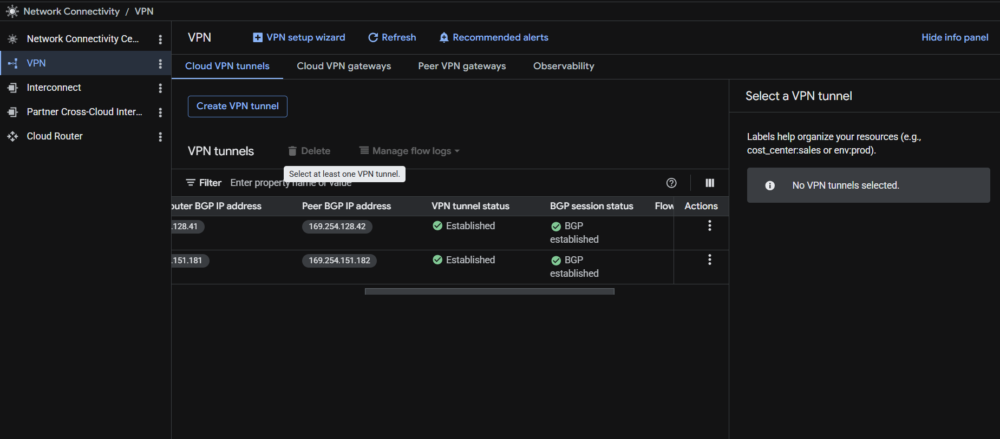
> Network Connectivity → VPN → Cloud VPN Tunnels — cả 2 tunnel `pfsense1` và `pfsense2` đều Established, xác nhận IPSec lên thành công từ cả 2 phía.

**BGP session chi tiết tunnel 1:**

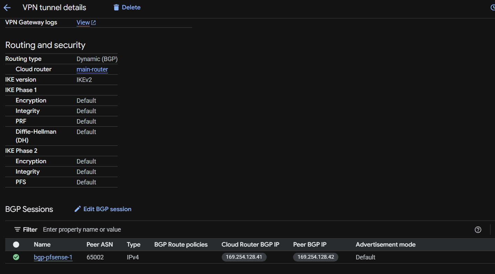
> BGP session tunnel 1 Established với peer `169.254.128.42` (pfSense) — GCP đã trao đổi route với pfSense qua tunnel này.

**BGP session chi tiết tunnel 2:**

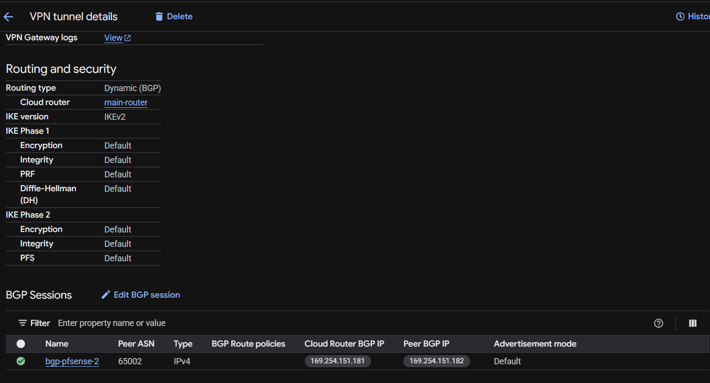
> BGP session tunnel 2 Established với peer `169.254.151.182` (pfSense) — 2 BGP session độc lập đảm bảo failover tự động khi một tunnel down.

**Cloud Router — tổng quan BGP sessions:**

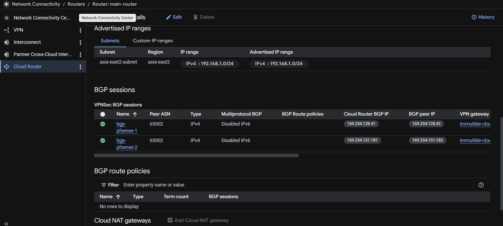
> Network Connectivity → Cloud Routers → main-router — thấy cả 2 BGP peer với pfSense ASN 65002 đang hoạt động.

**Routes học được từ pfSense qua tunnel 1:**

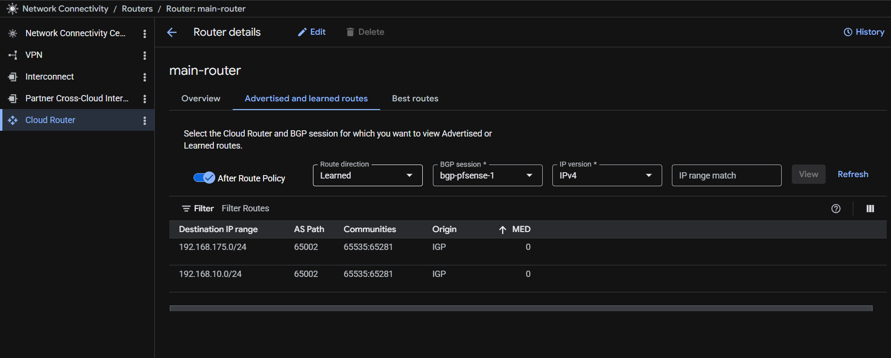
> Cloud Router đã học được route `192.168.10.0/24` (on-prem DB subnet) từ pfSense qua tunnel 1 — GCP biết đường đi về PostgreSQL on-premises.

**Routes học được từ pfSense qua tunnel 2:**

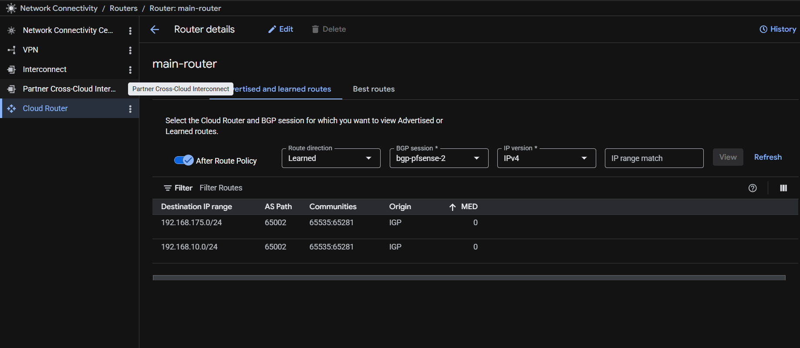
> Route `192.168.10.0/24` cũng được học qua tunnel 2 — khi tunnel 1 down, GCP tự động dùng tunnel 2 để forward traffic về on-prem mà không cần cấu hình lại.

**Routes của vpc:**

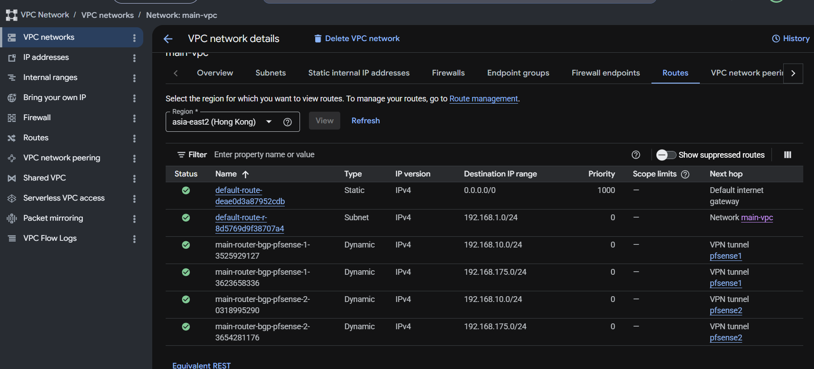

> Route qua `192.168.10.0/24` đã được vpc học được


